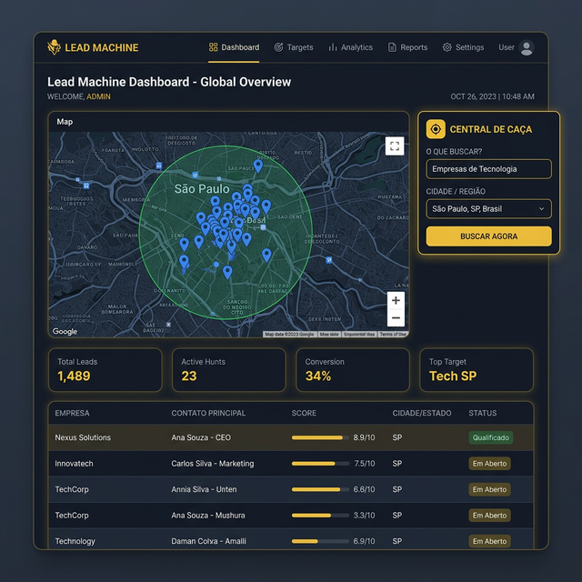

# ⚡ LEAD MACHINE | GEO HUNTER v6

[](https://opensource.org/licenses/MIT)
[](https://www.python.org/)
[](https://flask.palletsprojects.com/)

O **Lead Machine** é uma plataforma de prospecção inteligente projetada para transformar a busca de clientes em um processo automatizado, geolocalizado e enriquecido por Inteligência Artificial. Com o módulo **Geo Hunter v6**, você pode "caçar" leads em qualquer região do mundo com precisão cirúrgica.



## 🎯 Principais Funcionalidades

- **📍 Geo Hunter v6**: Busca de estabelecimentos e empresas via mapa utilizando a API Geapify Places.
- **🔍 Extração Stealth**: Filtros avançados por categoria, região e raio de alcance (até 50km).
- **🤖 IA Sales Script**: Geração automática de scripts de vendas personalizados (IA Pitch) para cada lead capturado.
- **📊 Lead Scoring**: Sistema de pontuação inteligente para priorizar os melhores contatos.
- **🏢 Enriquecimento CNPJ**: Integração direta com dados da Receita Federal e OpenCNPJ para detalhes societários e fiscais.
- **💼 Painel Administrativo**: Gestão completa de usuários, leads e histórico de prospecção.

## 🛠️ Tech Stack

- **Backend:** Python / Flask
- **Banco de Dados:** SQLite (SQLAlchemy ORM)
- **Frontend:** HTML5, Modern CSS (Glassmorphism), JavaScript
- **APIs:** Geapify (Mapas/Places), OpenCNPJ (Dados Fiscais), OpenAI/Groq (IA Pitch)
- **Segurança:** Flask-Login para gestão de sessões e acessos.

## 🚀 Como Executar

### Pré-requisitos
- Python 3.8 ou superior
- Pip (gerenciador de pacotes)

### Instalação

1. Clone o repositório:
```bash
git clone https://github.com/seu-usuario/lead-machine.git
cd lead-machine
```

2. Crie e ative um ambiente virtual:
```bash
python -m venv venv
# Windows:
venv\Scripts\activate
# Linux/Mac:
source venv/bin/activate
```

3. Instale as dependências:
```bash
pip install -r requirements.txt
```

4. Inicialize o banco de dados:
```bash
python init_db.py
```

5. Execute a aplicação:
```bash
python app.py
```
Acesse em: `http://localhost:5050` (Login padrão: `admin` / Senha: `123`)

## 📂 Estrutura do Projeto

```text
lead_machine/
├── database/           # Modelos e banco SQLite
├── models/             # Definições de tabelas SQLAlchemy
├── routes/             # Blueprints de rotas (Auth, Leads)
├── scraper/            # Lógica de extração de dados
├── services/           # Integrações (CNPJ, IA, Maps)
├── static/             # CSS, JS e Imagens
├── templates/          # Arquivos HTML (Jinja2)
├── app.py              # Ponto de entrada da aplicação
└── config.py           # Configurações de ambiente
```

## 📄 Licença

Distribuído sob a licença MIT. Veja `LICENSE` para mais informações.

---
Desenvolvido com ❤️ por William John
